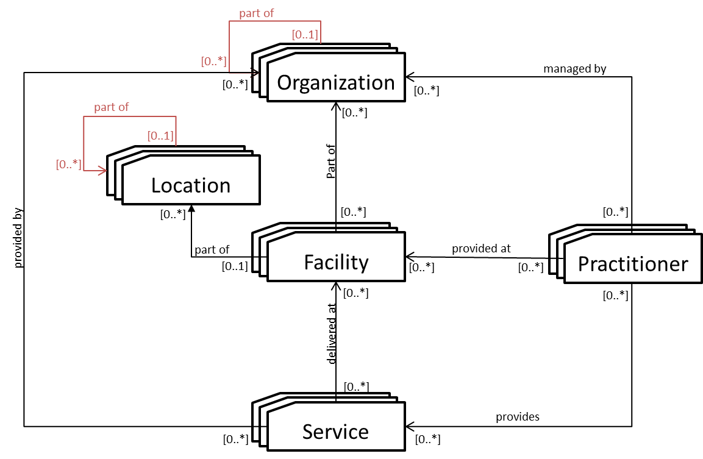
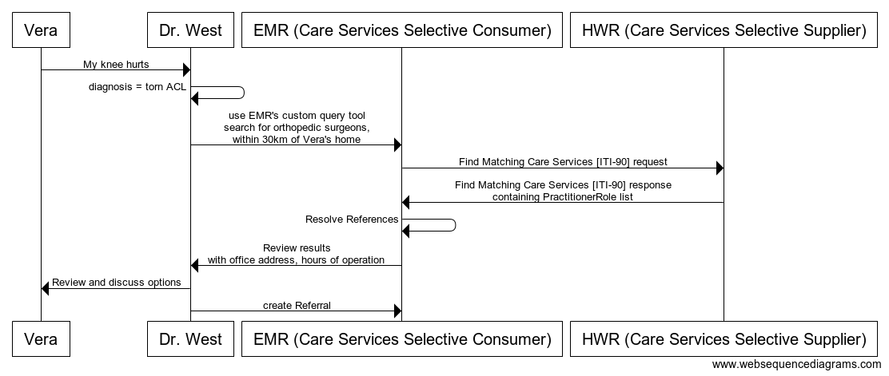
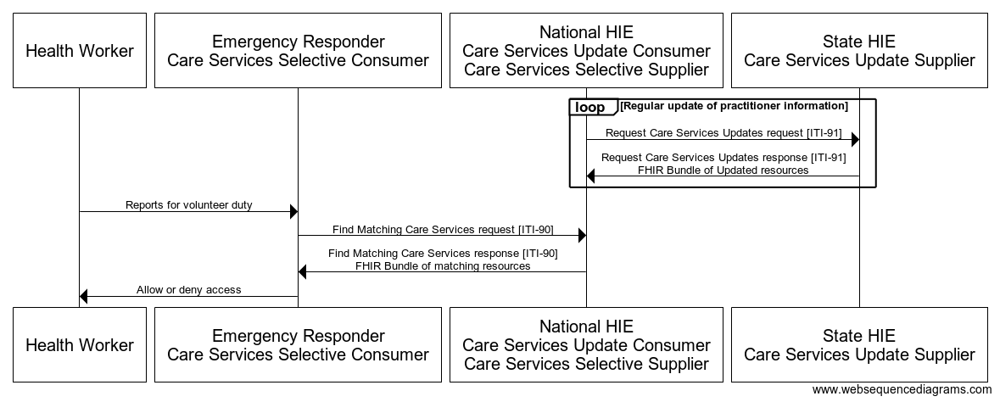
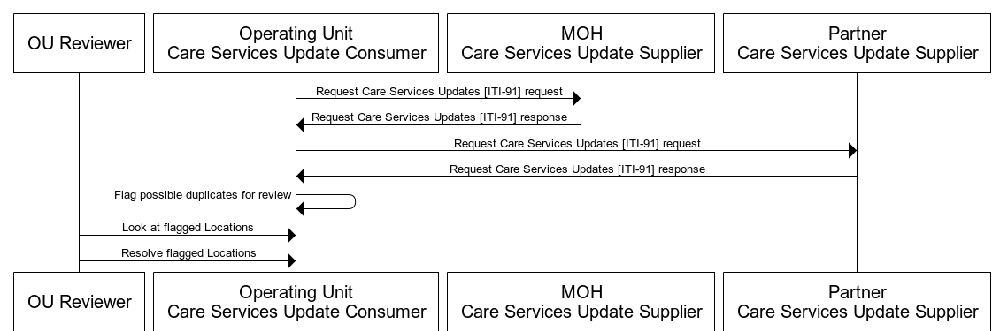
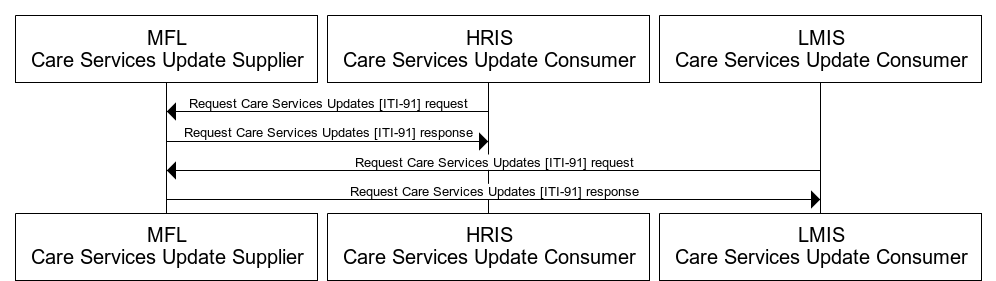

**Integrating the Healthcare Enterprise**

**IHE IT Infrastructure**

**Technical Framework Supplement**

**Mobile Care Services Discovery**

**(mCSD)**

**HL7® FHIR® Release 4**

**Using FHIR Resources at FMM Level 2-3**

**Rev. 3.2 – Trial Implementation**

Date: August 28, 2020

Author: IT Infrastructure Technical Committee

Email: iti@ihe.net

**Please verify you have the most recent version of this document.** See
[here](http://ihe.net/Technical_Frameworks/) for Trial Implementation
and Final Text versions and [here](http://ihe.net/Public_Comment/) for
Public Comment versions.

**Foreword**

This is a supplement to the IHE IT Infrastructure Technical Framework
V17.0. Each supplement undergoes a process of public comment and trial
implementation before being incorporated into the volumes of the
Technical Frameworks.

This supplement is published on August 28, 2020 for trial implementation
and may be available for testing at subsequent IHE Connectathons. The
supplement may be amended based on the results of testing. Following
successful testing it will be incorporated into the IT Infrastructure
Technical Framework. Comments are invited and can be submitted at
[http://www.ihe.net/ITI\_Public\_Comments](http://www.ihe.net/ITI_Public_Comments/).

This supplement describes changes to the existing technical framework
documents.

“Boxed” instructions like the sample below indicate to the Volume Editor
how to integrate the relevant section(s) into the relevant Technical
Framework volume.

Amend Section X.X by the following:

Where the amendment adds text, make the added text
**bold underline**. Where the amendment
removes text, make the removed text **~~bold strikethrough~~**. When
entire new sections are added, introduce with editor’s instructions to
“add new text” or similar, which for readability are not bolded or
underlined.

General information about IHE can be found at
[http://ihe.net](http://ihe.net/).

Information about the IHE IT Infrastructure domain can be found at
[http://ihe.net/IHE\_Domains](http://ihe.net/IHE_Domains/).

Information about the organization of IHE Technical Frameworks and
Supplements and the process used to create them can be found at
[http://ihe.net/IHE\_Process](http://ihe.net/IHE_Process/) and
[http://ihe.net/Profiles](http://ihe.net/Profiles/).

The current version of the IHE IT Infrastructure Technical Framework can
be found at
[http://ihe.net/Technical\_Frameworks](http://ihe.net/Technical_Frameworks/).

CONTENTS

[Introduction to this Supplement 6](#introduction-to-this-supplement)

[Open Issues and Questions 8](#open-issues-and-questions)

[Closed Issues 8](#closed-issues)

[General Introduction 11](#_Toc49437497)

[Appendix A – Actor Summary Definitions
11](#appendix-a-actor-summary-definitions)

[Appendix B – Transaction Summary Definitions
11](#appendix-b-transaction-summary-definitions)

[Glossary 11](#glossary)

[**Volume 1 – Profiles 12**](#_Toc49437501)

[Copyright Licenses 12](#copyright-licenses)

[46 Mobile Care Services Discovery (mCSD) Profile
13](#mobile-care-services-discovery-mcsd-profile)

[46.1 mCSD Actors, Transactions, and Content Modules
14](#mcsd-actors-transactions-and-content-modules)

[46.1.1 Actor Descriptions and Actor Profile Requirements
15](#actor-descriptions-and-actor-profile-requirements)

[46.2 mCSD Actor Options 15](#mcsd-actor-options)

[46.2.1 Location Distance Option 15](#location-distance-option)

[46.3 mCSD Required Actor Groupings 15](#mcsd-required-actor-groupings)

[46.4 mCSD Overview 16](#mcsd-overview)

[**46.4.1 Concepts** 16](#concepts)

[46.4.1.1 Create, Update, and Delete Services
17](#create-update-and-delete-services)

[**46.4.2 Use Cases** 17](#use-cases)

[46.4.2.1 Use Case \#1: Practitioner Query
17](#use-case-1-practitioner-query)

[46.4.2.1.1 Practitioner Query Use Case Description
17](#practitioner-query-use-case-description)

[46.4.2.1.2 Practitioner Query Process Flow
17](#practitioner-query-process-flow)

[46.4.2.2 Use Case \#2: Provider Lookup During an Emergency Event
18](#use-case-2-provider-lookup-during-an-emergency-event)

[46.4.2.2.1 Provider Lookup During an Emergency Event Use Case
Description
18](#provider-lookup-during-an-emergency-event-use-case-description)

[46.4.2.2.2 Provider Lookup During an Emergency Event Process Flow
18](#provider-lookup-during-an-emergency-event-process-flow)

[46.4.2.3 Use Case \#3: Cross-jurisdictional Site Management
20](#use-case-3-cross-jurisdictional-site-management)

[46.4.2.3.1 Cross-jurisdictional Site Management Description
20](#cross-jurisdictional-site-management-description)

[46.4.2.3.2 Cross-jurisdictional Site Management Process Flow
20](#cross-jurisdictional-site-management-process-flow)

[46.4.2.4 Use Case \#4: Master Facility List
22](#use-case-4-master-facility-list)

[46.4.2.4.1 Master Facility List Description
22](#master-facility-list-description)

[46.4.2.4.2 Master Facility List Process Flow
22](#master-facility-list-process-flow)

[46.5 mCSD Security Considerations 23](#mcsd-security-considerations)

[46.6 mCSD Cross Profile Considerations
24](#mcsd-cross-profile-considerations)

[46.6.1 Aggregate Data Exchange – ADX 24](#aggregate-data-exchange-adx)

[46.6.2 Care Services Discovery – CSD 24](#care-services-discovery-csd)

[46.6.3 Health Provider Directory – HPD
24](#health-provider-directory-hpd)

[46.6.4 Mobile Alert Communication Management – mACM
24](#mobile-alert-communication-management-macm)

[46.7 mCSD Deployment Considerations
25](#mcsd-deployment-considerations)

[46.7.1 Simple Deployment 25](#simple-deployment)

[46.7.2 Federated and Cross-Jurisdictional Deployments
25](#federated-and-cross-jurisdictional-deployments)

[46.7.2.1 Terminology Services 27](#terminology-services)

[**Volume 2c – Transactions 28**](#_Toc336000611)

[3.90 Find Matching Care Services \[ITI-90\]
28](#find-matching-care-services-iti-90)

[3.90.1 Scope 28](#scope)

[3.90.2 Actor Roles 28](#actor-roles)

[3.90.3 Referenced Standards 28](#referenced-standards)

[3.90.4 Messages 28](#messages)

[3.90.4.1 Find Matching Care Services Request Message
29](#find-matching-care-services-request-message)

[3.90.4.1.1 Trigger Events 29](#trigger-events)

[3.90.4.1.2 Message Semantics 29](#message-semantics)

[3.90.4.1.2.1 Common Parameters 29](#common-parameters)

[3.90.4.1.2.2 Organization Resource Message Semantics
30](#organization-resource-message-semantics)

[3.90.4.1.2.3 Location Resource Message Semantics
30](#location-resource-message-semantics)

[3.90.4.1.2.4 Practitioner Resource Message Semantics
31](#practitioner-resource-message-semantics)

[3.90.4.1.2.5 PractitionerRole Resource Message Semantics
31](#practitionerrole-resource-message-semantics)

[3.90.4.1.2.6 HealthcareService Resource Message Semantics
32](#healthcareservice-resource-message-semantics)

[3.90.4.1.2.7 Location Distance Option Message Semantics
32](#location-distance-option-message-semantics)

[3.90.4.1.3 Expected Actions 32](#expected-actions)

[3.90.4.2 Find Matching Care Services Response Message
32](#find-matching-care-services-response-message)

[3.90.4.2.1 Trigger Events 32](#trigger-events-1)

[3.90.4.2.2 Message Semantics 33](#message-semantics-1)

[3.90.4.2.2.1 FHIR Organization Resource Constraints
33](#fhir-organization-resource-constraints)

[3.90.4.2.2.2 FHIR Location Resource Constraints
34](#fhir-location-resource-constraints)

[3.90.4.2.2.3 FHIR Practitioner Resource Constraints
36](#fhir-practitioner-resource-constraints)

[3.90.4.2.2.4 FHIR PractitionerRole Resource Constraints
37](#fhir-practitionerrole-resource-constraints)

[3.90.4.2.2.5 FHIR HealthcareService Resource Constraints
37](#fhir-healthcareservice-resource-constraints)

[3.90.4.2.3 Expected Actions 38](#expected-actions-1)

[3.90.5 Security Considerations 38](#security-considerations)

[3.91 Request Care Services Updates \[ITI-91\]
38](#request-care-services-updates-iti-91)

[3.91.1 Scope 38](#scope-1)

[3.91.2 Actor Roles 38](#actor-roles-1)

[3.91.3 Referenced Standards 39](#referenced-standards-1)

[3.91.4 Messages 39](#messages-1)

[3.91.4.1 Request Care Services Updates Request Message
39](#request-care-services-updates-request-message)

[3.91.4.1.1 Trigger Events 39](#trigger-events-2)

[3.91.4.1.2 Message Semantics 39](#message-semantics-2)

[3.91.4.1.3 Expected Actions 40](#expected-actions-2)

[3.91.4.2 Request Care Services Updates Response Message
40](#request-care-services-updates-response-message)

[3.91.4.2.1 Trigger Events 40](#trigger-events-3)

[3.91.4.2.2 Message Semantics 40](#message-semantics-3)

[3.91.4.2.2.1 FHIR Organization Resource Constraints
40](#fhir-organization-resource-constraints-1)

[3.91.4.2.2.2 FHIR Location Resource Constraints
41](#fhir-location-resource-constraints-1)

[3.91.4.2.2.3 FHIR Practitioner Resource Constraints
41](#fhir-practitioner-resource-constraints-1)

[3.91.4.2.2.4 FHIR PractitionerRole Resource Constraints
41](#fhir-practitionerrole-resource-constraints-1)

[3.91.4.2.2.5 FHIR HealthcareService Resource Constraints
41](#fhir-healthcareservice-resource-constraints-1)

[3.91.4.2.3 Expected Actions 41](#expected-actions-3)

[3.91.5 Security Considerations 41](#security-considerations-1)

[**Volume 3 – Content Modules 43**](#_Toc49437581)

[**Volume 4 – National Extensions 43**](#_IHEActCode_Vocabulary)

#   
Introduction to this Supplement

<table>
<tbody>
<tr class="odd">
<td>
Whenever possible, IHE profiles are based on established and stable underlying standards. However, if an IHE domain determines that an emerging standard has high likelihood of industry adoption, and the standard offers significant benefits for the use cases it is attempting to address, the domain may develop IHE profiles based on such a standard. During Trial Implementation, the IHE domain will update and republish the IHE profile as the underlying standard evolves.

Product implementations and site deployments may need to be updated in order for them to remain interoperable and conformant with an updated IHE profile.

This mCSD Profile incorporates content from Release 4 of the emerging HL7®[1] FHIR®[2] specification. HL7 describes FHIR Change Management and Versioning at <a href="https://www.hl7.org/fhir/versions.html">https://www.hl7.org/fhir/versions.html</a>.

HL7 provides a rating of the maturity of FHIR content based on the FHIR Maturity Model (FMM): level 0 (draft) through N (Normative). See <a href="http://hl7.org/fhir/versions.html#maturity">http://hl7.org/fhir/versions.html#maturity</a>.

The FMM levels for FHIR content used in this profile are:

<table>
<thead>
<tr class="header">
<th>FHIR Content</th>
<th>FMM Level</th>
</tr>
</thead>
<tbody>
<tr class="odd">
<td>Organization Resource</td>
<td>3</td>
</tr>
<tr class="even">
<td>Location Resource</td>
<td>3</td>
</tr>
<tr class="odd">
<td>Practitioner Resource</td>
<td>3</td>
</tr>
<tr class="even">
<td>PractitionerRole Resource</td>
<td>2</td>
</tr>
<tr class="odd">
<td>HealthcareService Resource</td>
<td>2</td>
</tr>
</tbody>
</table></td>
</tr>
</tbody>
</table>

The Mobile Care Services Discovery (mCSD) Profile supports RESTful
queries across the following related care service resources:

1.  **Organization** – Organizations are “umbrella” entities; these may
    be considered the administrative bodies under whose auspices care
    services are provided such as Healthcare Information Exchanges
    (HIEs), Integrated Delivery Networks (IDNs), Non-Government
    Organizations (NGOs), Faith-Based Organizations (FBOs) or even a
    one-physician family practice. An organization has a unique
    identifier and may have additional administrative attributes such as
    contact person, mailing address, etc. Departments of an institution,
    or other administrative units, may be represented as child
    Organizations of a parent Organization.

2.  **Facility** – Facilities are physical care delivery sites such as
    hospitals, clinics, health outposts, physician offices, labs,
    pharmacies, etc. A Facility has a unique identifier, geographic
    attributes (address, geocode), contact attributes, attributes
    regarding its hours of operation, etc. Each Facility is defined by a
    pairing of Location and Organization.

3.  **Location** – Locations are physical places where care can be
    delivered such as facilities, buildings, wards, rooms, or vehicles.
    Locations also include political administrative units such as a
    village districts or regions. A Location has a unique identifier and
    may have geographic attributes (address, geocode), attributes
    regarding its hours of operation, etc. Each Location may be related
    to one Organization. A location may have a hierarchical relationship
    with other locations.

4.  **Practitioner** – A Practitioner is a health worker such as defined
    by WHO (<http://www.who.int/whr/2006/06_chap1_en.pdf>); a
    Practitioner might be a physician, nurse, pharmacist, community
    health worker, district health manager, etc. Practitioners have
    contact and demographic attributes. Each Practitioner may be related
    to one or more Organizations, one or more Locations and one or more
    Healthcare Services. Specific attributes may be associated with the
    Practitioner relationship with these other entities.

5.  **Healthcare Service** – Each healthcare service has a unique
    identifier. Examples include surgical services, antenatal care
    services, or primary care services. The combination of a Healthcare
    Service offered at a Location may have specific attributes including
    contact person, hours of operation, etc.

The mCSD Profile describes four actors and the transactions between
them. The Find Matching Care Services transaction allows a consumer to
search a supplier based on allowed parameters to get a bundle of
matching resources. The Request Care Services Updates transaction allows
a consumer to get a complete list of updated resources based on a
timestamp from the supplier.

1.  **Care Services Selective Consumer** – the Care Services Selective
    Consumer submits search queries to the Care Services Selective
    Supplier, which returns the requested resource(s).

<!-- end list -->

6.  **Care Services Selective Supplier** – the Care Services Selective
    Supplier processes inbound queries from Care Services Selective
    Consumers and returns responses from local data.

7.  **Care Services Update Consumer** – the Care Services Update
    Consumer queries updates from one or more Care Services Update
    Suppliers.

8.  **Care Services Update Supplier** – the Care Services Update
    Supplier is responsible for returning a bundle of resources in
    response to a refresh request from a Care Services Update Consumer.
    The response bundle contains content which has been inserted or
    updated in the listing since the last refresh.

Because it maintains interlinked directory information, the mCSD Profile
is able to respond to queries such as:

  - Which locations are associated with which organizations?

  - What services are provided at specific locations or, conversely,
    where are the locations that provide a specified service?

  - Who are the practitioners associated with a particular organization;
    what services do they provide; at which locations do they provide
    these services, and when?

The loosely coupled design and flexible querying capability of the mCSD
Profile means it can be deployed within a variety of eHealth
architectures and support a wide array of care workflows.

## Open Issues and Questions

mCSD\_7. Should there be additional required search parameters? Should
we also require any reverse chaining (\_has) options for the search?
Should we require any reverse includes (\_revinclude)? These would add
complexity to the server and most will have similar options through
include and normal chaining.

mCSD\_8. IHE has updated mCSD to add support for organizational
facilities. As part of this revision of mCSD, we have removed the
“Organization Option”, “Location Option”, “Practitioner Option”, and
“Healthcare Services Option”. These options existed to enable servers
to focus only on a small subset of the resources. The actual burden to
support all resources is small and set of options seems to add
unnecessary complexity. The result would be that servers shall support
all of the FHIR Resources, the clients can use the FHIR Resources in the
way defined. If there is concern with the removal of these options,
please submit a Public Comment.

mCSD\_9. We have added a requirement to include a meta.profile tag for
all compliant resources. This is so that in a mixed server that has
these resources as well as others, a Care Services Selective Consumer
can limit the results of Find Matching Care Service \[ITI-90\] to only
mCSD resources using the \_profile parameter. Since this type of
parameter isn’t allowed for the \_history transaction for Request Care
Services Updates \[ITI-91\] the Care Services Update Consumer may have
to filter results if required. Is this a common configuration and is
this step necessary?

## Closed Issues

*mCSD\_1. Should we include the FreeBusy transaction and use cases or
just remove them?*

  - Take this out, and possibly add later if needed as an option.

*mCSD\_2. Should we include the aggregate reporting use case from Care
Services Discovery (CSD) or remove with a reference to Aggregate Data
Exchange (ADX) in cross profile considerations? This use case would
define options for the actors in this use case to return aggregate data.
*

  - At this time we do not believe these are key uses cases, but request
    feedback.

*mCSD\_3. How do we capture data about community health workers? In some
environments, there are community health workers that are associated
with a facility but don't actually work there. Such a worker might have
a set area of villages that they rotate through providing
community-based care. The villages are within the catchment area of a
Health facility, and the supervisor of the community health worker may
be based at that facility. *

*Not quite sure the best way to capture this when looking at:*

[*http://build.fhir.org/location.html\#bnr*](http://build.fhir.org/location.html#bnr)

*It is clear that we have a hierarchy of locations to capture the
geographic hierarchy (jurisdictions): *

  - *The health facility in question would be situated at a location
    above the village level, say at the county or district level - this
    we can capture in the parent-child relationship “partOf” in the
    location resource*

  - *The community health worker is providing services at several
    villages - this we can capture through the location data field of
    the role in the practitioner resource*

  - *The community health worker is associated to a health facility -
    again we can capture this through the location field but perhaps we
    would use a different role to indicate that they're community health
    worker associated to this facility but not directly providing
    services at the facility, only its catchment area*

  - *In case a community health worker is reporting to a supervisor -
    that's not captured anywhere that I can see in FHIR. I think this is
    a larger that exists beyond the community health worker context*

Perhaps the best way to model this is to define each village as a
location, and associate that worker with each location they rotate
through. Each village is a partOf the health district. The facility is
also a location that is partOf the district. The practitioner is related
to the village locations with a "delivers care to" role; and to the
facility with a "based out of" role.

*mCSD\_4. Do we need to include more geospatial data (such as polygons
or more complex geometry types) stored with Locations and how? This
would be so jurisdictions (such as districts or counties) could include
that data instead of just a position (latitude/longitude).
[CP\#13391](http://gforge.hl7.org/gf/project/fhir/tracker/?action=TrackerItemEdit&tracker_item_id=13391)
has been opened for this.*

As per the request, FHIR has added a standard extension to address this:
<https://www.hl7.org/fhir/extension-location-boundary-geojson.html>

*mCSD\_5. With a federated deployment, data may come from multiple
sources and there can be an issue with resolving duplicate records and
maintaining the mapping. Patient has a link field and we have opened a
CP for Organization, Location, and Practitioner. CP
[GF\#13264](http://gforge.hl7.org/gf/project/fhir/tracker/?action=TrackerItemEdit&tracker_item_id=13264)
has been opened for this. There is also the Linkage resource, but it is
maturity level 0.*

FHIR has closed the issued with the recommendation to use the Linkage
resource to handle this.

*mCSD\_6. We need a way to deprecate identifiers. For now we can use
period and we have created a CP to add an entry to the use field:
[GF\#13265](http://gforge.hl7.org/gf/project/fhir/tracker/?action=TrackerItemEdit&tracker_item_id=13265).*

FHIR has added an additional Identifier.use code of “old” for this case.

General Introduction

Update the following Appendices to the General Introduction as indicated
below. Note that these are not appendices to Volume 1.

# Appendix A – Actor Summary Definitions

Add the following actors to the IHE Technical Frameworks General
Introduction list of actors:

| Actor                            | Definition                                                                                                                                                                                                                                                                                |
| -------------------------------- | ----------------------------------------------------------------------------------------------------------------------------------------------------------------------------------------------------------------------------------------------------------------------------------------- |
| Care Services Selective Consumer | The Care Services Selective Consumer queries the Care Services Selective Supplier for information about healthcare practitioners, organizations, locations, and services.                                                                                                                 |
| Care Services Selective Supplier | The Care Services Selective Supplier processes received queries from Care Services Selective Consumers and returns information about healthcare practitioners, organizations, locations, and services.                                                                                    |
| Care Services Update Consumer    | The Care Services Update Consumer can query for updates since a previous refresh, to information about healthcare practitioners, organizations, locations, and services from one or more Care Services Update Suppliers.                                                                  |
| Care Services Update Supplier    | The Care Services Update Supplier can provide updates about healthcare practitioners, organizations, locations, and services information in response to a refresh request from a Care Services Update Consumer. The updates include new or modified information since a previous refresh. |

# Appendix B – Transaction Summary Definitions

Add the following transactions to the IHE Technical Frameworks General
Introduction list of transactions:

| Transaction                              | Definition                                                                                                                                                                                                                                                                                                                           |
| ---------------------------------------- | ------------------------------------------------------------------------------------------------------------------------------------------------------------------------------------------------------------------------------------------------------------------------------------------------------------------------------------ |
| Find Matching Care Services \[ITI-90\]   | The Find Matching Care Services transaction is used to query for practitioners, locations, organizations, and healthcare services resources as well as links between these resources. The Find Matching Care Services transaction is initiated by the Care Services Selective Consumer against the Care Services Selective Supplier. |
| Request Care Services Updates \[ITI-91\] | The Request Care Services Updates is used to obtain practitioners, locations, organizations, and healthcare services resources that have been inserted or updated since the specified timestamp. The Request Care Services Updates is initiated by the Care Services Update Consumer against the Care Services Update Supplier.      |

# Glossary

Add the following glossary terms to the IHE Technical Frameworks General
Introduction Glossary:

No new Glossary terms.

Volume 1 – Profiles

## Copyright Licenses

Add the following to the IHE Technical Frameworks General Introduction
Copyright section:

None

Add Section 46

# 46 Mobile Care Services Discovery (mCSD) Profile

The Mobile Care Services Discovery (mCSD) Profile supports discovery of
care services resources using a RESTful interface in interrelated,
federated environments.

The profile supports querying for:

1.  **Organization** – Organizations are “umbrella” entities; these may
    be considered the administrative bodies under whose auspices care
    services are provided such as Healthcare Information Exchanges
    (HIEs), Integrated Delivery Networks (IDNs), Non-Government
    Organizations (NGOs), Faith-Based Organizations (FBOs) or even a
    one-physician family practice. An organization has a unique
    identifier and may have additional administrative attributes such as
    contact person, mailing address, etc. Departments of an institution,
    or other administrative units, may be represented as child
    Organizations of a parent Organization.

2.  **Facility** – Facilities are physical care delivery sites such as
    hospitals, clinics, health outposts, physician offices, labs,
    pharmacies, etc. A Facility has a unique identifier, geographic
    attributes (address, geocode), contact attributes, attributes
    regarding its hours of operation, etc. Each Facility is defined by a
    pairing of Location and Organization.

3.  **Location** – Locations are physical places where care can be
    delivered such as facilities, buildings, wards, rooms, or vehicles.
    Locations also include political administrative units such as a
    village districts or regions. A Location has a unique identifier and
    may have geographic attributes (address, geocode), attributes
    regarding its hours of operation, etc. Each Location may be related
    to one Organization. A location may have a hierarchical relationship
    with other locations.

<!-- end list -->

9.  **Practitioner** – A Practitioner is a health worker such as defined
    by WHO (<http://www.who.int/whr/2006/06_chap1_en.pdf>); a
    Practitioner might be a physician, nurse, pharmacist, community
    health worker, district health manager, etc. Practitioners have
    contact and demographic attributes. Each Practitioner may be related
    to one or more Organizations, one or more Locations and one or more
    Healthcare Services. Specific attributes may be associated with the
    Practitioner relationship with these other entities.

10. **Healthcare Service** – Each healthcare service has a unique
    identifier. Examples include surgical services, antenatal care
    services, or primary care services. The combination of a Healthcare
    Service offered at a Location may have specific attributes including
    contact person, hours of operation, etc.

The capabilities detailed in this profile support consumer-centric
queries such as finding “where is the closest youth mental health
services clinic” or “what are the hours of a physiotherapist near my
workplace”. In addition, mCSD supports crucial health system management
workflows. This can include reporting and analyses, such as “what are my
health human resource capacities, by facility, by cadre,” “what are all
the services offered at this facility,” or conversely, “where are all
the facilities that offer this service.” The mCSD Profile may be
employed to support, for example, the Provider Queries listed by the US
Office of the National Coordinator as part of the Standards and
Interoperability Framework ([http://wiki.siframework.org/file/view/ESI
Query and
Response.pdf](http://wiki.siframework.org/file/view/ESI%20Query%20and%20Response.pdf)).

The loosely coupled design and flexible querying capability of the mCSD
Profile means it can be deployed within a variety of eHealth
architectures and support a wide array of care workflows.

## 46.1 mCSD Actors, Transactions, and Content Modules

This section defines the actors, transactions, and/or content modules in
this profile. General definitions of actors are given in the Technical
Frameworks General Introduction Appendix A at
<https://www.ihe.net/resources/technical_frameworks/#GenIntro>.

Figure 46.1-1 shows the actors directly involved in the mCSD Profile and
the relevant transactions between them. If needed for context, other
actors that may be indirectly involved due to their participation in
other related profiles are shown in dotted lines. Actors which have a
mandatory grouping are shown in conjoined boxes.

Figure 46.1-1: mCSD Actor Diagram

Table 46.1-1 lists the transactions for each actor directly involved in
the mCSD Profile. To claim compliance with this profile, an actor shall
support all required transactions (labeled “R”) and may support the
optional transactions (labeled “O”).

Table 46.1-1: mCSD Profile - Actors and Transactions

|                                  |                                          |                        |             |                 |
| -------------------------------- | ---------------------------------------- | ---------------------- | ----------- | --------------- |
| Actors                           | Transactions                             | Initiator or Responder | Optionality | Reference       |
| Care Services Selective Consumer | Find Matching Care Services \[ITI-90\]   | Initiator              | R           | ITI TF-2c: 3.90 |
| Care Services Selective Supplier | Find Matching Care Services \[ITI-90\]   | Responder              | R           | ITI TF-2c: 3.90 |
| Care Services Update Consumer    | Request Care Services Updates \[ITI-91\] | Initiator              | R           | ITI TF-2c: 3.91 |
| Care Services Update Supplier    | Request Care Services Updates \[ITI-91\] | Responder              | R           | ITI TF-2c: 3.91 |

### 46.1.1 Actor Descriptions and Actor Profile Requirements

Most requirements are documented in ITI TF-2: Transactions. This section
documents any additional requirements on mCSD actors.

mCSD supports querying for Organization, Facility, Location,
Practitioner, and Healthcare Service. However, a Care Services Selective
Supplier or Care Service Update Supplier is not required to contain data
on all of these.

## 46.2 mCSD Actor Options

Options that may be selected for each actor in this profile, if any, are
listed in the Table 46.2-1. Dependencies between options when applicable
are specified in notes.

Table 46.2-1: mCSD - Actors and Options

|                                  |                          |                |
| -------------------------------- | ------------------------ | -------------- |
| Actor                            | Option Name              | Reference      |
| Care Services Selective Consumer | Location Distance Option | Section 46.2.1 |
| Care Services Selective Supplier | Location Distance Option | Section 46.2.1 |
| Care Services Update Consumer    | No options defined       | \--            |
| Care Services Update Supplier    | No options defined       | \--            |

### 46.2.1 Location Distance Option

The Location Distance Option enables querying Location resources based
on relative distances.

A Care Services Selective Consumer or Care Services Selective Supplier
that supports the Location Distance Option will implement the semantics
for the Location Distance Option of the Find Matching Care Services
\[ITI-90\] transaction. See ITI TF-2c: 3.90.4.1.2.2 and ITI TF-2c:
3.90.4.2.2.2.

## 46.3 mCSD Required Actor Groupings 

An actor from this profile (Column 1) shall implement all of the
required transactions and/or content modules in this profile ***in
addition to*** ***all*** of the
requirements for the grouped actor (Column 2).

Section 46.5 describes some optional groupings that may be of interest
for security considerations and Section 46.6 describes some optional
groupings in other related profiles.

Table 46.3-1: mCSD - Required Actor Groupings

|                                  |                          |           |                            |
| -------------------------------- | ------------------------ | --------- | -------------------------- |
| mCSD Actor                       | Actor to be grouped with | Reference | Content Bindings Reference |
| Care Services Selective Consumer | None                     | \--       | \--                        |
| Care Services Selective Supplier | None                     | \--       | \--                        |
| Care Services Update Consumer    | None                     | \--       | \--                        |
| Care Services Update Supplier    | None                     | \--       | \--                        |

## 46.4 mCSD Overview

### **46.4.1 Concepts**

The Mobile Care Services Discovery (mCSD) Profile supports queries for
organizations, locations, facilities, practitioners, and healthcare
services. The relationship between these entities is illustrated in
Figure 46.4.1-1.

Figure 46.4.1-1: Top-level Relationships between Care Services Entities

#### 46.4.1.1 Create, Update, and Delete Services

This profile enables tracking of changes to, searching for, and
retrieval of, a set of resources. The creation, update, deletion and
other maintenance activities of those resources is out of the scope of
this profile.

### **46.4.2 Use Cases**

#### 46.4.2.1 Use Case \#1: Practitioner Query

##### 46.4.2.1.1 Practitioner Query Use Case Description

The patient, Vera Brooks, consults with her physician who recommends
surgery. The physician can assist the patient in finding a suitable
surgeon, taking into consideration the location and specialty of the
surgeon.

##### 46.4.2.1.2 Practitioner Query Process Flow

  - Vera Brooks sees her family physician, Dr. West, regarding a recent
    knee injury.

  - Dr. West diagnoses the problem as a torn ACL and decides to refer
    Vera to an orthopedic surgeon.

  - Dr. West uses her EMR query tool, which implements a Care Services
    Selective Consumer to search for orthopedic surgeons within 30km of
    Vera’s home.

  - The EMR retrieves the information from a Healthcare Worker Registry
    (HWR) and displays it to Dr. West.

  - Vera and Dr. West decide on an orthopedic surgeon; Dr. West prepares
    a referral.

The interactions between the various actors in this use case are shown
in Figure 46.4.2.1.2-1.

Figure 46.4.2.1.2-1: Provider Query Use Case

The text in Figure 46.4.2.1.2-2 was used to generate the diagram in
Figure 46.4.2.1.2-1. Readers will generally find the diagram more
informative. The text is included here to facilitate editing.

@startuml

Vera -\> Dr. West: My knee hurts

Dr. West -\> Dr. West: diagnosis = torn ACL

Dr. West -\> EMR (Care Services Selective Consumer): use EMR's custom
query tool \\nsearch for orthopedic surgeons, \\nwithin 30km of Vera's
home

EMR (Care Services Selective Consumer) -\> HWR (Care Services Selective
Supplier): Find Matching Care Services \[ITI-90\] request

HWR (Care Services Selective Supplier) -\> EMR (Care Services Selective
Consumer): Find Matching Care Services \[ITI-90\] response\\ncontaining
PractitionerRole list

EMR (Care Services Selective Consumer) -\> EMR (Care Services Selective
Consumer) : Resolve References

EMR (Care Services Selective Consumer) -\> Dr. West : Review
results\\nwith office address, hours of operation

Dr. West -\> Vera: Review and discuss options

Dr. West -\> EMR (Care Services Selective Consumer): create Referral

@enduml

Figure 46.4.2.1.2-2: Provider Query Use Case Diagram Pseudocode

#### 46.4.2.2 Use Case \#2: Provider Lookup During an Emergency Event

##### 46.4.2.2.1 Provider Lookup During an Emergency Event Use Case Description

During an emergency event, medical volunteers may report to assist. At
an emergency site, the mCSD service can be queried to quickly identify
and grant permission to credentialed providers to enter the scene.

During Hurricane Katrina, health care volunteers were turned away from
disaster sites because there was no means available to verify their
credentials. During the Ebola outbreak in West Africa, it was unclear
which health workers were available and had been trained in clinical
care techniques.

Resources from jurisdictional areas can be reported up to a central
location so there is a single point of access. This would make it easier
for responders on location to verify the credentials of a reporting
health worker.

##### 46.4.2.2.2 Provider Lookup During an Emergency Event Process Flow

  - A jurisdictional (state/district) Care Services Update Supplier will
    provide data to a central Care Services Update Consumer (National
    HIE).

  - The National HIE will be a Care Services Update Consumer grouped
    with a Care Services Selective Supplier.

  - An emergency responder (e.g., police on site controlling access) can
    use a Care Services Selective Consumer to validate the credentials
    of a reporting health worker from the central Care Services Update
    Supplier.

  - Based on the result, the emergency responder can allow or deny
    access to the reporting health worker.

The interactions between the various actors in this use case are shown
in Figure 46.4.2.2.2-1.

Figure 46.4.2.2.2-1: Federated Data Site Management Workflow

The text in Figure 46.4.2.2.2-2 was used to generate the diagram in
Figure 46.4.2.2.2-1. Readers will generally find the diagram more
informative. The text is included here to facilitate editing.

@startuml

participant Health Worker

participant Emergency Responder\\nCare Services Selective Consumer

participant National HIE\\nCare Services Update Consumer\\nCare Services
Selective Supplier

participant State HIE\\nCare Services Update Supplier

loop Regular update of practitioner information

National HIE\\nCare Services Update Consumer\\nCare Services Selective
Supplier -\> State HIE\\nCare Services Update Supplier : Request Care
Services Updates request \[ITI-91\]

State HIE\\nCare Services Update Supplier -\> National HIE\\nCare
Services Update Consumer\\nCare Services Selective Supplier : Request
Care Services Updates response \[ITI-91\]\\nFHIR Bundle of Updated
resources

end

Health Worker -\> Emergency Responder\\nCare Services Selective Consumer
: Reports for volunteer duty

Emergency Responder\\nCare Services Selective Consumer -\> National
HIE\\nCare Services Update Consumer\\nCare Services Selective Supplier :
Find Matching Care Services request \[ITI-90\]

National HIE\\nCare Services Update Consumer\\nCare Services Selective
Supplier -\> Emergency Responder\\nCare Services Selective Consumer :
Find Matching Care Services response \[ITI-90\]\\nFHIR Bundle of
matching resources

Emergency Responder\\nCare Services Selective Consumer -\> Health Worker
: Allow or deny access

@enduml

Figure 46.4.2.2.2-2: Federated Data Site Management Workflow Diagram
Pseudocode

#### 46.4.2.3 Use Case \#3: Cross-jurisdictional Site Management 

##### 46.4.2.3.1 Cross-jurisdictional Site Management Description

Projects like the U.S. President's Emergency Plan for AIDS Relief
(PEPFAR)’s Data for Accountability, Transparency, and Impact (DATIM)
need to have public health and service delivery indicators reported from
a large number of sites (health facilities, communities, warehouses)
within an Operating Unit (country/region). Within an Operating Unit,
there are multiple, possibly overlapping, jurisdictions in operation
which are managed by multiple organizations (e.g., ministries of health
(MoH), faith-based organizations, international non-governmental
organizations). The project needs to receive indicator submissions from
pre-existing data systems hosted by these organizations. This data
exchange requires a way to share site lists and implement identifier
mapping between the sites in these lists. 

Figure 46.4.2.3.1-1: Cross-Jurisdictional Data Exchange

##### 46.4.2.3.2 Cross-jurisdictional Site Management Process Flow

An Operating Unit (OU) will run a Care Services Update Consumer and Care
Services Update Supplier for a specific geographic area (e.g., country).
This Update Consumer will query other organizations (ministries of
health, partners) operating in the geographic area to get updated site
data for the sites managed by the OU.

  - An OU Update Consumer will query a sub-unit Care Services Update
    Suppliers (e.g., MoH) to get an updated list of sites under the
    sub-unit.

  - An OU Update Consumer will query a subunit Care Services Update
    Suppliers (e.g., partner) to get an updated list of sites under the
    subunit.

  - The OU Update Consumer will use entity matching to determine if
    there are duplicated sites in the combined data and flag them for
    review. (See
    <https://wiki.ohie.org/display/documents/OpenHIE+Entity+Matching+Service>)

The interactions between the various actors in this use case are shown
in Figure 46.4.2.3.2-1.

Figure 46.4.2.3.2-1: Cross-jurisdictional Site Management Workflow

The text in Figure 46.4.2.3.2-2 was used to generate the diagram in
Figure 46.4.2.3.2-1. Readers will generally find the diagram more
informative. The text is included here to facilitate editing.

@startuml

participant OU Reviewer

participant Operating Unit\\nCare Services Update Consumer

participant MOH\\nCare Services Update Supplier

participant Partner\\nCare Services Update Supplier

Operating Unit\\nCare Services Update Consumer-\>MOH\\nCare Services
Update Supplier: Request Care Services Updates \[ITI-91\] request

MOH\\nCare Services Update Supplier-\>Operating Unit\\nCare Services
Update Consumer: Request Care Services Updates \[ITI-91\] response

Operating Unit\\nCare Services Update Consumer-\>Partner\\nCare Services
Update Supplier: Request Care Services Updates \[ITI-91\] request

Partner\\nCare Services Update Supplier-\>Operating Unit\\nCare Services
Update Consumer: Request Care Services Updates \[ITI-91\] response

Operating Unit\\nCare Services Update Consumer-\>Operating Unit\\nCare
Services Update Consumer: Flag possible duplicates for review

OU Reviewer-\>Operating Unit\\nCare Services Update Consumer: Look at
flagged Locations

OU Reviewer-\>Operating Unit\\nCare Services Update Consumer: Resolve
flagged Locations

@enduml

Figure 46.4.2.3.2-2: Cross-jurisdictional Site Management Workflow
Diagram Pseudocode

#### 46.4.2.4 Use Case \#4: Master Facility List 

##### 46.4.2.4.1 Master Facility List Description

A developing country has decided to implement a Master Facility List
(MFL) based on recommendations from the WHO in the MFL Resource Package
(<https://www.who.int/healthinfo/country_monitoring_evaluation/mfl/en/>).
This resource includes a minimum data set to uniquely identify,
location, and contact a specific facility. Since this will be a single
source of information for the country, there may be differing
hierarchies that need to be supported for the facilities. For example,
one hierarchy would be the administrative hierarchy for the country
(region, district, county). Another would be the supply chain hierarchy
where hubs may be located separately from administrative regions. Yet
another could be a reporting hierarchy used to send data to
international organizations.

##### 46.4.2.4.2 Master Facility List Process Flow

A Master Facility List (MFL) will run a Care Services Update Supplier
and Care Services Selective Supplier for an entire country. A Human
Resources Information System (HRIS) will run a Care Services Update
Consumer to retrieve the list of facilities. A Logistics Management
Information System (LMIS) will run a Care Services Update Consumer to
retrieve the list of facilities.

  - An HRIS will query the MFL for an updated list of facilities where
    Practitioners can provide care.

  - An LMIS will query the MFL for an updated list of facilities for the
    supply chain to deliver health care supplies.

  - The MFL will return updated facilities to each of these systems with
    multiple hierarchies.

The interactions between the various actors in this use case are shown
in Figure 46.4.2.4.1-1.

Figure 46.4.2.4.2-1: Master Facility List Workflow

The text in Figure 46.4.2.4.2-2 was used to generate the diagram in
Figure 46.4.2.4.2-1. Readers will generally find the diagram more
informative. The text is included here to facilitate editing.

@startuml

participant MFL\\nCare Services Update Supplier

participant HRIS\\nCare Services Update Consumer

participant LMIS\\nCare Services Update Consumer

HRIS\\nCare Services Update Consumer-\>MFL\\nCare Services Update
Supplier: Request Care Services Updates \[ITI-91\] request

MFL\\nCare Services Update Supplier-\>HRIS\\nCare Services Update
Consumer: Request Care Services Updates \[ITI-91\] response

LMIS\\nCare Services Update Consumer-\>MFL\\nCare Services Update
Supplier: Request Care Services Updates \[ITI-91\] request

MFL\\nCare Services Update Supplier-\>LMIS\\nCare Services Update
Consumer: Request Care Services Updates \[ITI-91\] response

@enduml

Figure 46.4.2.4.2-2: Master Facility List Workflow Diagram Pseudocode

## 46.5 mCSD Security Considerations

The resources exchanged in this profile may contain information which
pose a privacy risk, or in some cases, a safety risk, to providers and
other personnel, as well as patients. For example, practitioner phone
numbers and home addresses may be conveyed. Implementers should
determine what data will be exposed by the system and what level of
public access there will be if any.

There are many reasonable methods of security for interoperability
transactions which can be implemented without modifying the
characteristics of the transactions in the mCSD Profile. The use of TLS
is encouraged, specifically the use of the ATNA Profile (see ITI TF-1:
9).

User authentication on mobile devices and browsers is typically handled
by more lightweight authentication schemes such as HTTP Authentication,
OAuth 2.0, or OpenID Connect. IHE has a set of profiles for user
authentication including Internet User Authentication (IUA) for
REST-based authentication. The network communication security and user
authentication are layered in the HTTP transport layer.

## 46.6 mCSD Cross Profile Considerations

### 46.6.1 Aggregate Data Exchange – ADX

The IHE QRPH Aggregate Data Exchange (ADX) Profile enables reporting of
public health and service delivery indicators in various locations. A
reporting system may play the role of a Care Services Update Consumer to
ensure that it has an updated list of the resources for the reporting
locations.

Additionally, a service that contains information on practitioners (and
may be a Care Services Selective Supplier or Care Services Update
Supplier) can also be used to generate an ADX message to satisfy the use
case of a district health manager running an aggregate report on
staffing levels by facility and health worker type from the ITI Care
Services Discovery (CSD) Profile.

### 46.6.2 Care Services Discovery – CSD

A Care Services Directory in the CSD Profile can be grouped with the
Care Services Update Supplier from mCSD. The CSD Care Services
InfoManager could implement the mCSD Care Services Update Consumer and
the Care Services Selective Supplier Actors. The CSD Service Finder
could implement the mCSD Care Services Selective Consumer. This enables
the CSD actors to allow RESTful transactions without having to change
the underlying data store.

### 46.6.3 Health Provider Directory – HPD

A Provider Information Source in HPD can also implement the Care
Services Update Supplier from mCSD. Note that in this case the Provider
Information Source would be queried for updates instead of pushing the
updates to the Consumer. The HPD Provider Information Directory could
implement the mCSD Care Services Update Consumer and the Care Services
Selective Supplier Actors. The HPD Provider Information Consumer could
implement the mCSD Care Services Selective Consumer. This enables the
HPD actors to allow RESTful transactions without having to change the
underlying data store.

### 46.6.4 Mobile Alert Communication Management – mACM

The mACM Profile defines the means to send an alert to practitioners.
The mCSD Profile provides a way to query that list of practitioners. A
mACM Alert Reporter can be grouped with a Care Services Update Consumer
or a Care Services Selective Consumer to ensure that it has an updated
list of practitioners.

## 46.7 mCSD Deployment Considerations

### 46.7.1 Simple Deployment

A deployment may only have a single server that will maintain data
(Organization, Location, Facility, Practitioner, and/or Healthcare
Service). In this case, you would only need the Care Services Selective
Supplier (or Care Services Update Supplier) to send search results back
to one or more Care Services Selective Consumers (or Care Services
Update Consumer). See Figure 46.7.1-1.

Figure 46.7.1-1: Simple Deployment

### 46.7.2 Federated and Cross-Jurisdictional Deployments

A Federated Deployment has multiple levels of the Care Services Update
Suppliers linked to Care Services Update Consumers. These Update
Consumers may also support being Care Services Update Suppliers so that
higher level Update Consumers can receive their updates. They may also
support being a Care Services Selective Supplier so that Selective
Consumer clients can query that level of information. See Figure
46.7.2-1.

Interrelated content is maintained by the Care Services Update Consumer.
The Care Services Update Consumer routinely obtains new or updated
content from Care Services Update Suppliers by polling them. These
updates may refresh a data cache which the Update Consumer maintains.
The Update Consumer’s cache is refreshed at an appropriate interval
specified by the implementing jurisdiction. The implementing
jurisdiction will consider the implications of out of date information
when setting the refresh interval between cache updates. The normal
delays in updating listings will also be part of this consideration.

The various data sources would maintain definitive data regarding one or
more of: Organization, Location, Healthcare Service, or Practitioner and
implement the Care Services Update Supplier. These Care Services Update
Suppliers would respond to a Care Services Update Consumer’s request for
new or updated content since a specified date and time. To support this
capability, a Care Services Update Supplier should support time stamped
updates. Data elements that are deprecated should not simply be deleted,
but rather are updated to an appropriate status indicating their
deprecation.

This deployment may also have cross-jurisdictional considerations if any
of the Update Suppliers have overlap in the data they manage. In this
instance, the Care Services Update Consumer would need to resolve any
conflicts before sharing this information as either a Care Services
Update Supplier or a Care Services Selective Supplier. The way in which
these conflicts are resolved is defined by the implementing jurisdiction
of the Care Services Update Consumer.

Figure 46.7.2-1: Federated and Cross Jurisdictional Deployment

The Care Services Selective Consumer is the actor that queries for
information about interrelated care services. These queries are sent to
the Care Services Selective Supplier who develops a response based on
the content in its local data store. When a Care Services Selective
Supplier is combined with a Care Services Update Consumer (Global and
Country servers from Figure 46.7.2-1), it should maintain a cache of the
aggregated information from all the configured Care Services Update
Suppliers it is linked to.

In order for the Care Services Update Consumer’s (Global and Country
servers) cached content to be able to serve its role as an interlinked
data source, the following conditions should be met by Care Services
Update Suppliers who maintain content.

1.  Implementing jurisdictions may mandate terminologies for
    Organization Type, Service Type, Location Type, Location Status,
    Practitioner Type, Practitioner Status, Contact Point Type,
    Credential Type, Specialization Code, and language code. Care
    Services Update Suppliers would be configurable to use these
    terminologies, where mandated. In the case of a cross jurisdictional
    deployment, mapping between the terminology used by the various
    jurisdictions may need to be maintained.

2.  Implementing jurisdictions may mandate conventions regarding the
    types, components and formatting of Name, Address and Address Line
    elements. Care Services Update Suppliers would be configurable to
    use these formatting conventions, where mandated.

3.  Implementing jurisdictions may mandate the source of truth regarding
    Organization ID, Healthcare Service ID, Location ID and Practitioner
    ID. Care Services Update Suppliers would ensure that all
    cross-referenced IDs match corresponding resources in the
    jurisdictionally mandated sources of truth.

For guidance on handling challenges regarding the representation of
names across multiple languages and in different cultures, refer to the
ITI TF-2a: 3.24.5.2.3.1. This section in the ITI Technical Framework
describes the use of the language tag as documented in IETF RFC1766 and
the HL7 XCN name data type.

#### 46.7.2.1 Terminology Services

All referenced terminologies from a Care Services Selective Supplier or
Care Services Update Supplier may be pre-coordinated or they may be
resolvable from one or more terminology services. Though it is out of
scope of the mCSD Profile to define the means of interacting with a
terminology service, this could be provided, for example, through the
Sharing Value Sets (SVS) Profile or using appropriate FHIR resources
(e.g., ValueSet).

Volume 2c – Transactions

Add Section 3.90

## 3.90 Find Matching Care Services \[ITI-90\]

### 3.90.1 Scope

The Find Matching Care Services transaction returns a list of matching
care services resources based on the query sent. A Care Services
Selective Consumer initiates a Find Matching Care Services transaction
against a Care Services Selective Supplier.

### 3.90.2 Actor Roles

| **Actor:** | Care Services Selective Consumer                                                                 |
| ---------- | ------------------------------------------------------------------------------------------------ |
| **Role:**  | Requests a list of resources from the Care Services Selective Supplier based on query parameters |
| **Actor:** | Care Services Selective Supplier                                                                 |
| **Role:**  | Accepts the query request and returns a list of matching resources.                              |

### 3.90.3 Referenced Standards

  - HL7 FHIR standard Release 4 <http://hl7.org/fhir/R4/index.html>

  - JSON – IETF RFC7159

  - XML

  - HTTP 1.1

### 3.90.4 Messages

Figure 3.90.4-1: Interaction Diagram

#### 3.90.4.1 Find Matching Care Services Request Message

The Find Matching Care Services message is a FHIR search operation on
the Organization, Location, Practitioner, PractitionerRole, and/or
HealthcareService Resources.

##### 3.90.4.1.1 Trigger Events

A Care Services Selective Consumer triggers a Find Matching Care
Services Request to a Care Services Selective Supplier according to the
business rules for the query. These business rules are outside the scope
of this transaction.

##### 3.90.4.1.2 Message Semantics

A Care Services Selective Consumer initiates a search request using HTTP
GET as defined at <http://hl7.org/fhir/R4/http.html#search> on the
Organization, Location, Practitioner, PractitionerRole, or
HealthcareService Resources. The query parameters are identified below.
A Care Services Selective Consumer may query any combination or subset
of the parameters.

A Care Services Selective Supplier shall support combinations of search
parameters as defined at <http://hl7.org/fhir/R4/search.html#combining>,
“Composite Search Parameters.”

A Care Services Selective Supplier shall support responding to a request
for both the JSON and the XML messaging formats as defined in FHIR. A
Care Services Selective Consumer shall accept either the JSON or the XML
messaging formats as defined in FHIR. See ITI TF-2x: Appendix Z.6 for
more details.

A Care Services Selective Supplier shall implement the parameters
described below. A Care Services Selective Supplier may choose to
support additional query parameters beyond the subset listed below. Any
additional query parameters supported shall be supported according to
the core FHIR specification.

See ITI TF-2x: Appendix W for informative implementation material for
this transaction.

###### 3.90.4.1.2.1 Common Parameters

The Care Services Selective Supplier shall support the :contains and
:exact modifiers in all of the string query parameters below.

The Care Services Selective Supplier shall support the following search
parameters as defined at <http://hl7.org/fhir/R4/search.html#all>.

\_id

\_lastUpdated

\_profile

The Care Services Selective Supplier shall also support the following
prefixes for the \_lastUpdated parameter: gt, lt, ge, le, sa, and eb.

###### 3.90.4.1.2.2 Organization Resource Message Semantics

The Care Services Selective Supplier shall support the following search
parameters on the Organization Resource as defined at
<http://hl7.org/fhir/R4/organization.html#search>. String parameter
modifiers are defined at <http://hl7.org/fhir/R4/search.html#string>.
The ihe-mcsd-hierarchy-\* search parameters query the hierarchy
extension identified by the following canonical URI
http://ihe.net/fhir/StructureDefinition/IHE\_mCSD\_hierarchy\_extension.

active

identifier

name

partof

partof:above

partof:below

type

partof.identifier

partof.name

\_revInclude=Location:organization

ihe-mcsd-hierarchy-type

ihe-mcsd-hierarchy-partof

ihe-mcsd-hierarchy-partof:above

ihe-mcsd-hierarchy-partof:below

###### 3.90.4.1.2.3 Location Resource Message Semantics

The Care Services Selective Supplier shall support the following search
parameters on the Location Resource as defined at
<http://hl7.org/fhir/R4/location.html#search>. String parameter
modifiers are defined at <http://hl7.org/fhir/R4/search.html#string>.

identifier

name

organization

partof

partof:above

partof:below

status

type

partof.identifier

partof.name

organization.active

organization.identifier

organization.name

\_include=Location:organization

###### 3.90.4.1.2.4 Practitioner Resource Message Semantics

The Care Services Selective Supplier shall support the following search
parameters on the Practitioner Resource as defined at
<http://hl7.org/fhir/R4/practitioner.html#search>. String parameter
modifiers are defined at <http://hl7.org/fhir/R4/search.html#string>.

active

identifier

name

given

family

###### 3.90.4.1.2.5 PractitionerRole Resource Message Semantics

The Care Services Selective Supplier shall support the following search
parameters on the PractitionerRole Resource as defined at
<http://hl7.org/fhir/R4/practitionerrole.html#search>.

active

location

organization

practitioner

role

service

specialty

practitioner.identifier

practitioner.name

practitioner.given

practitioner.family

\_include=PractitionerRole:practitioner

organization.active

organization.identifier

organization.name

location.status

location.identifier

location.name

service.active

service.indentifier

service.location

service.name

service.organization

###### 3.90.4.1.2.6 HealthcareService Resource Message Semantics

The Care Services Selective Supplier shall support the following search
parameters on the HealthcareService Resource as defined at
<http://hl7.org/fhir/R4/healthcareservice.html#search>. String parameter
modifiers are defined at <http://hl7.org/fhir/R4/search.html#string>.

active

identifier

location

name

organization

service-type

organization.active

organization.identifier

organization.name

location.status

location.identifier

location.name

###### 3.90.4.1.2.7 Location Distance Option Message Semantics

The Care Services Selective Supplier supporting the Location Distance
Option shall support the following search parameters on the Location
Resource as defined at <http://hl7.org/fhir/R4/location.html#search>.

near

##### 3.90.4.1.3 Expected Actions

The Care Services Selective Supplier shall process the query to discover
the resources that match the search parameters given, and return a
response as per Section 3.90.4.2 or an error as per
<http://hl7.org/fhir/R4/search.html#errors>.

#### 3.90.4.2 Find Matching Care Services Response Message

##### 3.90.4.2.1 Trigger Events

The Care Services Selective Supplier sends the Find Matching Care
Services Response to the Care Services Selective Consumer when results
to the query are ready.

##### 3.90.4.2.2 Message Semantics

The Care Services Selective Supplier shall support the search response
message as defined at <http://hl7.org/fhir/R4/http.html#search> on the
following Resources.

  - Organization, as defined at
    <http://hl7.org/fhir/R4/organization.html>

  - Location, as defined at <http://hl7.org/fhir/R4/location.html>

  - Practitioner, as defined at
    <http://hl7.org/fhir/R4/practitioner.html>

  - PractitionerRole, as defined at
    <http://hl7.org/fhir/R4/practitionerrole.html>

  - HealthcareService, as defined at
    <http://hl7.org/fhir/R4/healthcareservice.html>
    
    All References (reference.reference element) to Resources defined in
    this transaction shall be populated with an accessible URL (see
    <https://www.hl7.org/fhir/references-definitions.html#Reference.reference>),
    unless the referenced resource is not present on a server accessible
    to the client.

###### 3.90.4.2.2.1 FHIR Organization Resource Constraints

A Care Services Selective Consumer may query on Organization Resources.
A Care Services Selective Supplier shall return a Bundle of matching
Organization Resources. The Organization Resource shall be further
constrained as described in Table 3.90.4.2.2.1-1. The Element column in
Table 3.90.4.2.2.1-1 references the object model defined at
<http://hl7.org/fhir/R4/organization.html#resource>.

Table 3.90.4.2.2.1-1: Organization Resource Constraints

<table>
<thead>
<tr class="header">
<th>
Element

&amp;

Cardinality
</th>
<th>Data Type</th>
</tr>
</thead>
<tbody>
<tr class="odd">
<td>
meta.profile

[1..*]
</td>
<td>
There shall be at least one entry with the value:

http://ihe.net/fhir/StructureDefinition/IHE_mCSD_Organization
</td>
</tr>
<tr class="even">
<td>
type

[1..*]
</td>
<td>
A code that describes the type of Organization.

CodeableConcept
</td>
</tr>
<tr class="odd">
<td>
name

[1..1]
</td>
<td>string</td>
</tr>
<tr class="even">
<td>partOf 
[0..1]</td>
<td>
If the Organization belongs to a single hierarchy, the partOf element shall be used.

Reference (Organization)
</td>
</tr>
<tr class="odd">
<td>
extension

[0..*]
</td>
<td>
If there are additional hierarchies (such as funding source), include them in the extension with the following details:

Set the url to the canonical URI for this extension

url = “<a href="http://ihe.net/fhir/StructureDefinition/IHE_mCSD_hierarchy_extension">http://ihe.net/fhir/StructureDefinition/IHE_mCSD_hierarchy_extension</a>”

Set the sub-extension values

hierarchy-type = valueCodeableConcept

part-of = valueReference(Organization)
</td>
</tr>
</tbody>
</table>

A Care Services Selective Consumer may query on Organization Resources
when working with Facilities. A Care Services Selective Supplier shall
return a Bundle of matching Organization Resources when working with
Facilities. In addition to the constraints in Table 3.90.4.2.2.1-1, the
FHIR Organization Resource shall be further constrained as described in
Table 3.90.4.2.2.1-2. The Element column in Table 3.90.4.2.2.1-2
references the object model defined at
<http://hl7.org/fhir/R4/organization.html#resource>.

Table 3.90.4.2.2.1-2: Additional Organization Resource Constraints for
Facilities

<table>
<thead>
<tr class="header">
<th>
Element

&amp;

Cardinality
</th>
<th>Data Type</th>
</tr>
</thead>
<tbody>
<tr class="odd">
<td>meta.profile [2..*]</td>
<td>
In addition, there shall be one entry with the value:

http://ihe.net/fhir/StructureDefinition/IHE_mCSD_FacilityOrganization
</td>
</tr>
<tr class="even">
<td>
type

[2..*]
</td>
<td>
In addition, there shall be one type with the following value:

system = "urn:ietf:rfc:3986"

code = "<a href="http://ihe.net/SYSTEM">urn:ihe:iti:mcsd:2019:facility</a>"
</td>
</tr>
</tbody>
</table>

###### 3.90.4.2.2.2 FHIR Location Resource Constraints

A Care Services Selective Consumer may query on Location Resources. A
Care Services Selective Supplier shall return a Bundle of matching
Location Resources. The Location Resource shall be further constrained
as described in Table 3.90.4.2.2.2-1. The Element column in Table
3.90.4.2.2.2-1 references the object model defined at
<http://hl7.org/fhir/R4/location.html#resource>.

Table 3.90.4.2.2.2-1: Location Resource Constraints

<table>
<thead>
<tr class="header">
<th>
Element

&amp;

Cardinality
</th>
<th>Data Type</th>
</tr>
</thead>
<tbody>
<tr class="odd">
<td>
meta.profile

[1..*]
</td>
<td>
There shall be at least one entry with the value:

http://ihe.net/fhir/StructureDefinition/IHE_mCSD_Location
</td>
</tr>
<tr class="even">
<td>
type

[1..*]
</td>
<td>
A code that describes the type of Organization.

CodeableConcept
</td>
</tr>
<tr class="odd">
<td>
physicalType

[1..1]
</td>
<td>
A code that describes the physical type of Organization.

CodeableConcept
</td>
</tr>
<tr class="even">
<td>
name

[1..1]
</td>
<td>string</td>
</tr>
<tr class="odd">
<td>
status

[1..1]
</td>
<td>code (active| suspended| inactive)</td>
</tr>
</tbody>
</table>

When the resource is a Facility, the Location Resource shall be paired
with an Organization Resource using the managingOrganization element in
Location. A Care Services Selective Consumer may query on Location
Resources when working with Facilities. A Care Services Selective
Supplier shall return a Bundle of matching Location Resources when
working with Facilities. In addition to the constraints in Table
3.90.4.2.2.2-1, the FHIR Location Resource shall be further constrained
as described in Table 3.90.4.2.2.2-2. The Element column in Table
3.90.4.2.2.2-2 references the object model defined at
<http://hl7.org/fhir/R4/location.html#resource>.

Table 3.90.4.2.2.2-2: Additional Location Resource Constraints for
Facilities

<table>
<thead>
<tr class="header">
<th>
Element

&amp;

Cardinality
</th>
<th>Data Type</th>
</tr>
</thead>
<tbody>
<tr class="odd">
<td>
meta.profile

[2..*]
</td>
<td>
In addition, there shall be one entry with the value:

http://ihe.net/fhir/StructureDefinition/IHE_mCSD_FacilityLocation
</td>
</tr>
<tr class="even">
<td>
type

[2..*]
</td>
<td>
In addition, there shall be one type with the following value:

system = "urn:ietf:rfc:3986"

code = "<a href="http://ihe.net/SYSTEM">urn:ihe:iti:mcsd:2019:facility</a>"
</td>
</tr>
<tr class="odd">
<td>
managingOrganization

[1..1]
</td>
<td>
The reference to the Organization resource for this facility.

Reference(Organization)
</td>
</tr>
</tbody>
</table>

When supporting the Location Distance Option. The Location Resource
shall be further constrained as described in Table 3.90.4.2.2.2-3. The
Element column in Table 3.90.4.2.2.2-3 references the object model
defined at <http://hl7.org/fhir/R4/location.html#resource>.

Table 3.90.4.2.2.2-3: Location Resource Constraints with Location
Distance Option

<table>
<thead>
<tr class="header">
<th>
Element

&amp;

Cardinality
</th>
<th>Data Type</th>
</tr>
</thead>
<tbody>
<tr class="odd">
<td>
meta.profile

[2..*]
</td>
<td>
There shall be at least one entry with the value:

http://ihe.net/fhir/StructureDefinition/IHE_mCSD_LocationDistance
</td>
</tr>
<tr class="even">
<td>
position

[1..1]
</td>
<td>BackboneElement</td>
</tr>
</tbody>
</table>

###### 3.90.4.2.2.3 FHIR Practitioner Resource Constraints

A Care Services Selective Consumer may query on Practitioner Resources.
A Care Services Selective Supplier shall return a Bundle of matching
Practitioner Resources. The Practitioner Resource shall be further
constrained as described in Table 3.90.4.2.2.3-1. The Element column in
Table 3.90.4.2.2.3-1 references the object model defined at
<http://hl7.org/fhir/R4/practitioner.html#resource>.

Table 3.90.4.2.2.3-1: Practitioner Resource Constraints

<table>
<thead>
<tr class="header">
<th>
Element

&amp;

Cardinality
</th>
<th>Data Type</th>
</tr>
</thead>
<tbody>
<tr class="odd">
<td>
meta.profile

[1..*]
</td>
<td>
There shall be at least one entry with the value:

http://ihe.net/fhir/StructureDefinition/IHE_mCSD_Practitioner
</td>
</tr>
<tr class="even">
<td>
name

[1..*]
</td>
<td>HumanName</td>
</tr>
</tbody>
</table>

###### 3.90.4.2.2.4 FHIR PractitionerRole Resource Constraints

A Care Services Selective Consumer may query on PractitionerRole
Resources. A Care Services Selective Supplier shall return a Bundle of
matching PractitionerRole Resources. The PractitionerRole Resource shall
be further constrained as described in Table 3.90.4.2.2.4-1. The Element
column in Table 3.90.4.2.2.4-1 references the object model defined at
<http://hl7.org/fhir/R4/practitionerrole.html#resource>.

Table 3.90.4.2.2.4-1: PractitionerRole Resource Constraints

<table>
<thead>
<tr class="header">
<th>
Element

&amp;

Cardinality
</th>
<th>Data Type</th>
</tr>
</thead>
<tbody>
<tr class="odd">
<td>
meta.profile

[1..*]
</td>
<td>
There shall be at least one entry with the value:

http://ihe.net/fhir/StructureDefinition/IHE_mCSD_PractitionerRole
</td>
</tr>
<tr class="even">
<td>
code

[1..*]
</td>
<td>CodeableConcept</td>
</tr>
</tbody>
</table>

###### 3.90.4.2.2.5 FHIR HealthcareService Resource Constraints

A Care Services Selective Consumer may query on HealthcareService
Resources. A Care Services Selective Supplier shall return a Bundle of
matching HealthcareService Resources. The HealthcareService Resource
shall be further constrained as described in Table 3.90.4.2.2.5-1. The
Element column in Table 3.90.4.2.2.5-1 references the object model
defined at <http://hl7.org/fhir/R4/healthcareservice.html#resource>.

Table 3.90.4.2.2.5-1: HealthcareService Resource Constraints

<table>
<thead>
<tr class="header">
<th>
Element

&amp;

Cardinality
</th>
<th>Data Type</th>
</tr>
</thead>
<tbody>
<tr class="odd">
<td>
meta.profile

[1..*]
</td>
<td>
There shall be at least one entry with the value:

http://ihe.net/fhir/StructureDefinition/IHE_mCSD_HealthcareService
</td>
</tr>
<tr class="even">
<td>
type

[1..*]
</td>
<td>CodeableConcept</td>
</tr>
<tr class="odd">
<td>
name

[1..1]
</td>
<td>string</td>
</tr>
</tbody>
</table>

##### 3.90.4.2.3 Expected Actions

The Care Services Selective Consumer has received the response and
continues with its workflow.

### 3.90.5 Security Considerations

See ITI TF-1: 46.5 for security considerations for the mCSD Profile.

See ITI TF-2x: Appendix Z.8 for common mobile security considerations.

## 3.91 Request Care Services Updates \[ITI-91\]

### 3.91.1 Scope

The Request Care Services Updates transaction is used to return a list
of updated care services resources. A Care Services Update Consumer
initiates a Request Care Services Updates transaction against a Care
Services Update Supplier.

### 3.91.2 Actor Roles

| **Actor:** | Care Services Update Consumer                                                |
| ---------- | ---------------------------------------------------------------------------- |
| **Role:**  | Requests a list of updated resources from the Care Services Update Supplier. |
| **Actor:** | Care Services Update Supplier                                                |
| **Role:**  | Accepts the update request and returns a list of updated resources.          |

### 3.91.3 Referenced Standards

  - HL7 FHIR standard Release 4 <http://hl7.org/fhir/R4/index.html>

  - JSON – IETF RFC7159

  - XML

  - HTTP 1.1

### 3.91.4 Messages

Figure 3.91.4-1: Interaction Diagram

#### 3.91.4.1 Request Care Services Updates Request Message

A Request Care Services Updates message is a FHIR history operation,
optionally using the \_since parameter, on the Organization, Location,
Practitioner, PractitionerRole, or HealthcareService Resources.

##### 3.91.4.1.1 Trigger Events

A Care Services Update Consumer triggers a Request Care Services Updates
Request to a Care Services Update Supplier according to the business
rules for the query. These business rules are outside the scope of this
transaction.

##### 3.91.4.1.2 Message Semantics

A Care Services Update Consumer initiates a history request using HTTP
GET as defined at <http://hl7.org/fhir/R4/http.html#history> on the
Organization, Location, Practitioner, PractitionerRole, or
HealthcareService Resources.

A Care Services Update Supplier and Care Services Update Consumer shall
support the following parameters.

\_since

They shall also support the requirements in ITI TF-2x: Z.6, Populating
the Expected Response Format.

A Care Services Update Supplier shall support receiving a request for
both the JSON and the XML messaging formats as defined in FHIR. A Care
Services Update Consumer shall accept either the JSON or the XML
messaging formats as defined in FHIR.

See ITI TF-2x: Appendix W for informative implementation material for
this transaction.

##### 3.91.4.1.3 Expected Actions

The Care Services Update Supplier shall process the query to discover
the resources that match the search parameters given, and gives a
response as per Section 3.91.4.2 or an error as per
<http://hl7.org/fhir/R4/search.html#errors>.

#### 3.91.4.2 Request Care Services Updates Response Message

The Request Care Services Updates \[ITI-91\] transaction uses the
response semantics as defined at
<http://hl7.org/fhir/R4/http.html#history> as applicable for the
resources.

##### 3.91.4.2.1 Trigger Events

The Care Services Update Supplier sends the Request Care Services
Updates Response to the Care Services Update Consumer when results are
ready.

##### 3.91.4.2.2 Message Semantics

The Care Services Update Supplier shall support the history response
message as defined at <http://hl7.org/fhir/R4/http.html#history> on the
following Resources:

  - Organization, as defined at
    <http://hl7.org/fhir/R4/organization.html>

  - Location, as defined at <http://hl7.org/fhir/R4/location.html>

  - Practitioner, as defined at
    <http://hl7.org/fhir/R4/practitioner.html>

  - PractitionerRole, as defined at
    <http://hl7.org/fhir/R4/practitionerrole.html>

  - HealthcareService, as defined at
    <http://hl7.org/fhir/R4/healthcareservice.html>
    
    All References (reference.reference element) to Resources defined in
    this transaction shall be populated with an accessible URL (see
    <https://www.hl7.org/fhir/references-definitions.html#Reference.reference>
    ), unless the referenced resource is not present on a server
    accessible to the client.

###### 3.91.4.2.2.1 FHIR Organization Resource Constraints

A Care Services Update Consumer and a Care Services Update Supplier
shall query or return an Organization Resource. The Organization
Resource shall be further constrained as described in Table
3.90.4.2.2.1-1. The Element column in Table 3.90.4.2.2.1-1 references
the object model defined at
<http://hl7.org/fhir/R4/organization.html#resource>.

When the Organization represents a Facility and is paired with a
Location, the FHIR Organization Resource shall be further constrained as
described in Table 3.90.4.2.2.1-2. The Element column in Table
3.90.4.2.2.1-2 references the object model defined at
<http://hl7.org/fhir/R4/organization.html#resource>.

###### 3.91.4.2.2.2 FHIR Location Resource Constraints

A Care Services Update Consumer and a Care Services Update Supplier
shall query or return a Location Resource. The Location Resource shall
be further constrained as described in Table 3.90.4.2.2.2-1. The Element
column in Table 3.90.4.2.2.2-1 references the object model defined at
<http://hl7.org/fhir/R4/location.html#resource>.

When the Location represents a Facility and is paired with an
Organization, the FHIR Location Resource shall be further constrained as
described in Table 3.90.4.2.2.2-2. The Element column in Table
3.90.4.2.2.2-2 references the object model defined at
<http://hl7.org/fhir/R4/location.html#resource>.

When supporting the Location Distance Option, the FHIR Location Resource
shall be further constrained as described in Table 3.90.4.2.2.2-3. The
Element column in Table 3.90.4.2.2.2-3 references the object model
defined at <http://hl7.org/fhir/R4/location.html#resource>.

###### 3.91.4.2.2.3 FHIR Practitioner Resource Constraints

A Care Services Update Consumer and a Care Services Update Supplier
shall query or return a Practitioner Resource. The Practitioner Resource
shall be further constrained as described in Table 3.90.4.2.2.3-1. The
Element column in Table 3.90.4.2.2.3-1 references the object model
defined at <http://hl7.org/fhir/R4/practitioner.html#resource>.

###### 3.91.4.2.2.4 FHIR PractitionerRole Resource Constraints

A Care Services Update Consumer and a Care Services Update Supplier
shall query or return a PractitionerRole Resource. The PractitionerRole
Resource shall be further constrained as described in Table
3.90.4.2.2.4-1. The Element column in Table 3.90.4.2.2.4-1 references
the object model defined at
<http://hl7.org/fhir/R4/practitionerrole.html#resource>.

###### 3.91.4.2.2.5 FHIR HealthcareService Resource Constraints

A Care Services Update Consumer and a Care Services Update Supplier
shall query or return a HealthcareService Resource. The
HealthcareService Resource shall be further constrained as described in
Table 3.90.4.2.2.5-1. The Element column in Table 3.90.4.2.2.5-1
references the object model defined at
<http://hl7.org/fhir/R4/healthcareservice.html#resource>.

##### 3.91.4.2.3 Expected Actions

The Care Services Update Consumer has received the response and
continues with its workflow.

### 3.91.5 Security Considerations

See ITI TF-1: 46.5 for security considerations for the mCSD Profile.

See ITI TF-2x: Appendix Z.8 for common mobile security considerations.

Volume 3 – Content Modules

No new content modules defined by this supplement.

Volume 4 –
National Extensions

Add appropriate Country section

None

1.  HL7 is the registered trademark of Health Level Seven International.

2.  FHIR is the registered trademark of Health Level Seven
    International.
